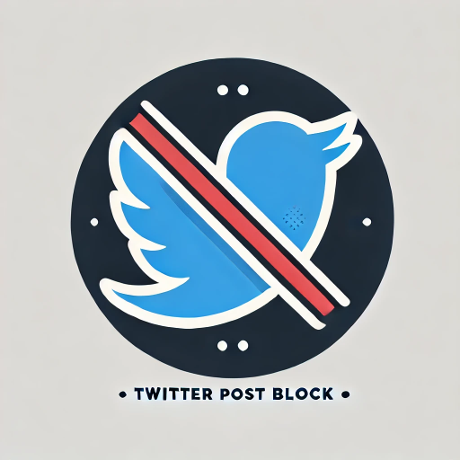
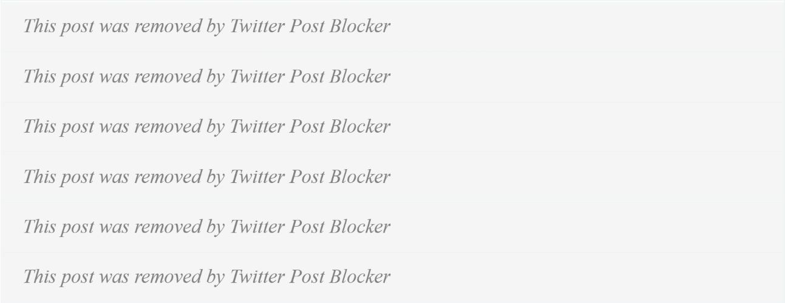

# **Twitter Post Blocker**



## **Overview**
Twitter Post Blocker is a Chrome extension that helps you manage your Twitter feed by blocking posts containing specific keywords. You can:
- Create and toggle word groups to block tweets.
- Easily block, mute, or mark posts as "Not Interested" using action buttons.
- Keep your feed clean and distraction-free!

---

## **Features**
- 🚫 Block tweets containing specific keywords.
- 🔕 Mute or 🚫 Block tweets directly with action buttons.
- 📊 Count how many posts have been blocked.
- 💡 Simple UI to manage your blocked words and toggle filters.

---

## **Installation**

### **Load the Extension Locally**
1. Download or clone this repository:
   ```bash
   git clone https://github.com/adiwish/Twitter-Post-Blocker.git
2. Open Chrome and go to chrome://extensions/.
3. Enable Developer mode (toggle in the top-right corner).
4. Click "Load unpacked" and select the folder where the repository is located.
5. The extension will appear in your toolbar.

## **How to Use**
### **Adding Blocked Words**
1. Click on the extension icon in the toolbar to open the popup.
2. Enter words to block in the input field, separated by commas.
3. Click Done to store your blocked words.
4. Refersh the page and any tweets containing these words will automatically be blocked.
### **Using Action Buttons**
- ☹️: Mark tweets as "Not Interested".
- 🚫: Block tweets from a user.
- 🔕: Mute tweets from a user.

### **Tracking Blocked Posts**
The popup displays the number of tweets blocked so far for your convenience.

### **Buttons**


### **Blocking Tweets in Action**



### **Contributing**
We welcome contributions to improve this extension! If you’d like to contribute:
1. Fork this repository.
2. Create a feature branch (git checkout -b feature-name).
3. Commit your changes (git commit -m "Add a feature").
4. Push to the branch (git push origin feature-name).
5. Open a pull request.
